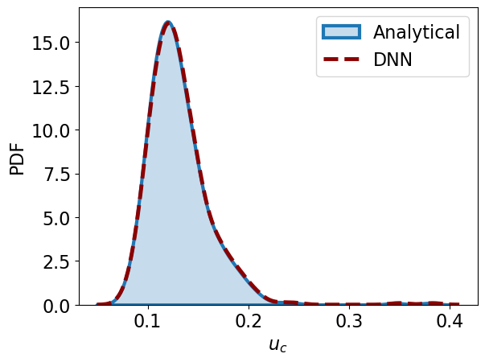

# LabelFree-DNN-Surrogate
[Surrogate Modeling for Fluid Flows Based on Physics-Constrained Label-Free Deep Learning](https://www.sciencedirect.com/science/article/pii/S004578251930622X)

[Luning Sun](https://scholar.google.com/citations?user=Jszc1B8AAAAJ&hl=en), [Han Gao](https://scholar.google.com/citations?hl=en&view_op=list_works&gmla=AJsN-F6-fOLOhBPu7QzW2uth-Hf-G_bt_tHSDMMiyZcj8_6FHXwf-WEeU4kAbw-yIi78KROeDuBUzH-ScfCjKhZ6l2Kn_TNfM9jrZqHJrv2Je6jEUXh63is&user=iYlVxoYAAAAJ&gmla=AJsN-F6LfoB1VHGNZfAANgEgbRRthg3W5A4G11UmbG1tPTITC-iosEYuDwLC19VRTc-KU397DgoKeYGBx8iJIoKtMvWQPhofZgPbvy1u4q10FXWdz1OoHrc&sciund=5241665522552596380), [Shaowu Pan](https://scholar.google.com/citations?user=VOv3F18AAAAJ&hl=en), [Jian-Xun Wang](http://sites.nd.edu/jianxun-wang/)

TensorFlow and PyTorch implementation of Physics-Constrained Label-Free Deep Learning

Parametric Pipe Flow
:-----:
<p align="center">
    
</p>

Small Aneurysm | Middle Aneurysm | Large Aneurysm
:-----:|:------:|:-----:
 |  | 

## Dependencies
- python 3
- PyTorch 0.4 and above
- TensorFlow 1.15
- matplotlib
- seaborn

## Installation
- Install PyTorch, TensorFlow and other dependencies

- Clone this repo:
```
git clone https://github.com/Jianxun-Wang/LabelFree-DNN-Surrogate.git
cd LabelFree-DNN-Surrogate
```

## Uncertainty Propagation
Perform UQ tasks, compare the distribution of Quantity of Interest (QoI) between DNN model and OpenFOAM benchmar, including:

- Parametric Pipe Flow
- Parametric Geometry Aneurysm (To Be Added)

Example : 
```
cd Tutorial
python pipe_post.py
```
Parametric Pipe Flow
:-----:
<p align="center">
    
</p>

## Training

### Parametric Pipe Flow 

Train a parametric DNN surrogate for pipe flow
```
cd Tutorial
python poiseuillePara.py
```
### Parametric Aneurysmal Flow

Train a parametric DNN surrogate for aneurysmal flow
```
cd ParametricAneurysm
python main.py
```

## Citation

If you find this repo useful for your research, please consider to cite:
```latex
@article{SUN2020112732,
title = "Surrogate modeling for fluid flows based on physics-constrained deep learning without simulation data",
journal = "Computer Methods in Applied Mechanics and Engineering",
volume = "361",
pages = "112732",
year = "2020",
issn = "0045-7825",
doi = "https://doi.org/10.1016/j.cma.2019.112732",
url = "http://www.sciencedirect.com/science/article/pii/S004578251930622X",
author = "Luning Sun and Han Gao and Shaowu Pan and Jian-Xun Wang"
}
```

## Acknowledgments

Thanks for all the co-authors and Dr. [Yinhao Zhu](https://scholar.google.com/citations?user=SZmaVZMAAAAJ&hl=en) for his valuable discussion.

Code is inspired by [cnn-surrogate](https://github.com/cics-nd/cnn-surrogate)
